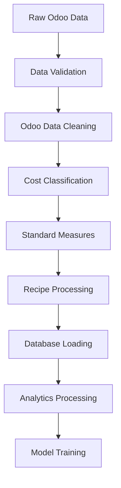
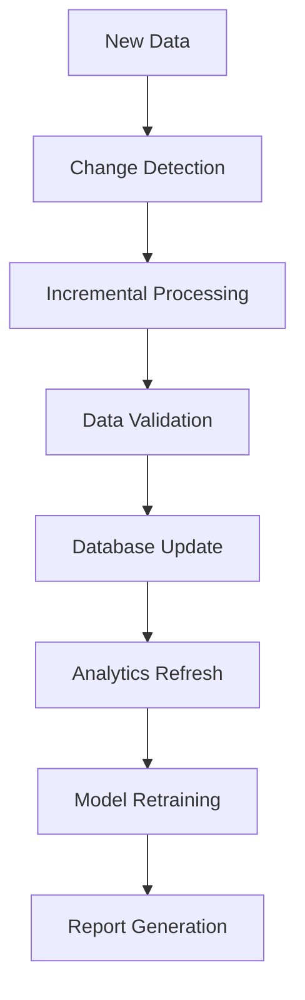

# 🍽️ Kizuna Restaurant Analytics - Django Full-Stack Architecture

## 📁 Project Structure

```
kizuna_restaurant_analytics/
├── 📄 README.md
├── 📄 requirements.txt
├── 📄 .env.example
├── 📄 docker-compose.yml
├── 📄 .gitignore
├── 📄 manage.py
├── 📄 setup.py
├── 📄 pyproject.toml
│
├── 📂 config/                                # Django settings
│   ├── 📄 __init__.py
│   ├── 📄 settings/
│   │   ├── 📄 __init__.py
│   │   ├── 📄 base.py                       # Base settings
│   │   ├── 📄 development.py                # Development settings
│   │   ├── 📄 production.py                 # Production settings
│   │   ├── 📄 testing.py                    # Testing settings
│   │   └── 📄 staging.py                    # Staging settings
│   ├── 📄 urls.py                           # Main URL configuration
│   ├── 📄 wsgi.py                           # WSGI configuration
│   ├── 📄 asgi.py                           # ASGI configuration
│   └── 📄 celery.py                         # Celery configuration
│
├── 📂 apps/                                 # Django applications
│   ├── 📄 __init__.py
│   │
│   ├── 📂 core/                             # Core application
│   │   ├── 📄 __init__.py
│   │   ├── 📄 models.py                     # Base models
│   │   ├── 📄 views.py                      # Core views
│   │   ├── 📄 urls.py                       # Core URLs
│   │   ├── 📄 admin.py                      # Admin configuration
│   │   ├── 📄 apps.py                       # App configuration
│   │   ├── 📄 permissions.py                # Custom permissions
│   │   ├── 📄 middleware.py                 # Custom middleware
│   │   └── 📂 management/
│   │       └── 📂 commands/
│   │           ├── 📄 __init__.py
│   │           ├── 📄 initial_data_load.py  # Initial 4-month data load
│   │           ├── 📄 weekly_data_update.py # Weekly data updates
│   │           └── 📄 monthly_data_update.py # Monthly data updates
│   │
│   ├── 📂 authentication/                   # User authentication
│   │   ├── 📄 __init__.py
│   │   ├── 📄 models.py                     # User models
│   │   ├── 📄 views.py                      # Auth views
│   │   ├── 📄 urls.py                       # Auth URLs
│   │   ├── 📄 serializers.py                # DRF serializers
│   │   ├── 📄 permissions.py                # Auth permissions
│   │   └── 📄 backends.py                   # Custom auth backends
│   │
│   ├── 📂 data_management/                  # Data management app
│   │   ├── 📄 __init__.py
│   │   ├── 📄 models.py                     # Data models
│   │   ├── 📄 views.py                      # Data management views
│   │   ├── 📄 urls.py                       # Data management URLs
│   │   ├── 📄 serializers.py                # API serializers
│   │   ├── 📄 admin.py                      # Admin interface
│   │   ├── 📄 tasks.py                      # Celery tasks
│   │   ├── 📄 validators.py                 # Data validators
│   │   ├── 📄 utils.py                      # Utility functions
│   │   └── 📂 migrations/                   # Database migrations
│   │       └── 📄 __init__.py
│   │
│   ├── 📂 restaurant_data/                  # Restaurant-specific data
│   │   ├── 📄 __init__.py
│   │   ├── 📄 models.py                     # Restaurant data models
│   │   │                                    # - Products, Orders, Purchases
│   │   │                                    # - Categories, Suppliers
│   │   ├── 📄 views.py                      # Data views
│   │   ├── 📄 urls.py                       # Data URLs
│   │   ├── 📄 serializers.py                # API serializers
│   │   ├── 📄 admin.py                      # Admin configuration
│   │   ├── 📄 managers.py                   # Custom model managers
│   │   └── 📂 migrations/
│   │       └── 📄 __init__.py
│   │
│   ├── 📂 recipes/                          # Recipe management
│   │   ├── 📄 __init__.py
│   │   ├── 📄 models.py                     # Recipe models
│   │   │                                    # - Recipes, Ingredients
│   │   │                                    # - RecipeItems, CostCalculations
│   │   ├── 📄 views.py                      # Recipe views
│   │   ├── 📄 urls.py                       # Recipe URLs
│   │   ├── 📄 serializers.py                # API serializers
│   │   ├── 📄 admin.py                      # Admin configuration
│   │   ├── 📄 tasks.py                      # Recipe processing tasks
│   │   ├── 📄 cost_calculator.py            # Cost calculation logic
│   │   └── 📂 migrations/
│   │       └── 📄 __init__.py
│   │
│   ├── 📂 analytics/                        # Analytics engine
│   │   ├── 📄 __init__.py
│   │   ├── 📄 models.py                     # Analytics models
│   │   ├── 📄 views.py                      # Analytics views
│   │   ├── 📄 urls.py                       # Analytics URLs
│   │   ├── 📄 serializers.py                # API serializers
│   │   ├── 📄 cogs_analyzer.py              # COGS analysis
│   │   ├── 📄 menu_engineering.py           # Menu engineering
│   │   ├── 📄 price_optimizer.py            # Price optimization
│   │   ├── 📄 cross_selling.py              # Cross-selling analysis
│   │   ├── 📄 combo_analyzer.py             # Combo analysis
│   │   ├── 📄 tasks.py                      # Analytics tasks
│   │   └── 📂 migrations/
│   │       └── 📄 __init__.py
│   │
│   ├── 📂 reports/                          # Reporting system
│   │   ├── 📄 __init__.py
│   │   ├── 📄 models.py                     # Report models
│   │   ├── 📄 views.py                      # Report views
│   │   ├── 📄 urls.py                       # Report URLs
│   │   ├── 📄 serializers.py                # API serializers
│   │   ├── 📄 generators.py                 # Report generators
│   │   ├── 📄 exporters.py                  # Export utilities
│   │   ├── 📄 tasks.py                      # Report generation tasks
│   │   └── 📂 templates/
│   │       ├── 📄 cogs_report.html
│   │       ├── 📄 menu_analysis_report.html
│   │       └── 📄 dashboard_report.html
│   │
│   └── 📂 api/                              # API application
│       ├── 📄 __init__.py
│       ├── 📄 urls.py                       # API URLs
│       ├── 📄 views.py                      # API views
│       ├── 📄 permissions.py                # API permissions
│       ├── 📄 pagination.py                 # Custom pagination
│       ├── 📄 throttling.py                 # API throttling
│       └── 📂 v1/                           # API versioning
│           ├── 📄 __init__.py
│           ├── 📄 urls.py
│           └── 📄 views.py
│
├── 📂 data_engineering/                     # Data Engineering Pipeline
│   ├── 📄 __init__.py
│   │
│   ├── 📂 extractors/                       # Data extraction
│   │   ├── 📄 __init__.py
│   │   ├── 📄 base_extractor.py             # Base extractor class
│   │   ├── 📄 odoo_extractor.py             # Odoo data extractor
│   │   ├── 📄 file_extractor.py             # File data extractor
│   │   ├── 📄 database_extractor.py         # Database extractor
│   │   └── 📄 api_extractor.py              # API data extractor
│   │
│   ├── 📂 transformers/                     # Data transformation
│   │   ├── 📄 __init__.py
│   │   ├── 📄 base_transformer.py           # Base transformer class
│   │   ├── 📄 odoo_data_cleaner.py          # Odoo data cleaning
│   │   ├── 📄 date_parser.py                # Date parsing utilities
│   │   ├── 📄 unit_converter.py             # Unit conversions
│   │   ├── 📄 cost_classifier.py            # Cost classification
│   │   ├── 📄 standard_measures.py          # Standard measure conversion
│   │   ├── 📄 recipe_processor.py           # Recipe processing
│   │   └── 📄 data_validator.py             # Data validation
│   │
│   ├── 📂 loaders/                          # Data loading
│   │   ├── 📄 __init__.py
│   │   ├── 📄 base_loader.py                # Base loader class
│   │   ├── 📄 database_loader.py            # Database loader
│   │   ├── 📄 bulk_loader.py                # Bulk data loader
│   │   ├── 📄 incremental_loader.py         # Incremental updates
│   │   └── 📄 file_loader.py                # File-based loader
│   │
│   ├── 📂 pipelines/                        # ETL pipelines
│   │   ├── 📄 __init__.py
│   │   ├── 📄 base_pipeline.py              # Base pipeline class
│   │   ├── 📄 initial_load_pipeline.py      # Initial 4-month data load
│   │   ├── 📄 weekly_update_pipeline.py     # Weekly data updates
│   │   ├── 📄 monthly_update_pipeline.py    # Monthly data updates
│   │   ├── 📄 recipe_pipeline.py            # Recipe processing pipeline
│   │   └── 📄 analytics_pipeline.py         # Analytics data pipeline
│   │
│   ├── 📂 quality/                          # Data quality management
│   │   ├── 📄 __init__.py
│   │   ├── 📄 quality_checker.py            # Data quality checks
│   │   ├── 📄 validation_rules.py           # Validation rules
│   │   ├── 📄 anomaly_detector.py           # Anomaly detection
│   │   ├── 📄 data_profiler.py              # Data profiling
│   │   └── 📄 quality_reports.py            # Quality reporting
│   │
│   ├── 📂 orchestration/                    # Workflow orchestration
│   │   ├── 📄 __init__.py
│   │   ├── 📄 scheduler.py                  # Job scheduling
│   │   ├── 📄 workflow_manager.py           # Workflow management
│   │   ├── 📄 dependency_resolver.py        # Dependency management
│   │   └── 📄 monitoring.py                 # Pipeline monitoring
│   │
│   └── 📂 config/                           # Pipeline configuration
│       ├── 📄 __init__.py
│       ├── 📄 pipeline_config.py            # Pipeline configurations
│       ├── 📄 data_sources.py               # Data source configs
│       └── 📄 transformation_rules.py       # Transformation rules
│
├── 📂 data_science/                         # Data Science Components
│   ├── 📄 __init__.py
│   │
│   ├── 📂 models/                           # ML/Statistical models
│   │   ├── 📄 __init__.py
│   │   ├── 📄 base_model.py                 # Base model class
│   │   ├── 📄 demand_forecasting.py         # Demand forecasting
│   │   ├── 📄 price_elasticity.py           # Price elasticity analysis
│   │   ├── 📄 customer_segmentation.py      # Customer segmentation
│   │   ├── 📄 churn_prediction.py           # Customer churn
│   │   ├── 📄 recommendation_engine.py      # Menu recommendations
│   │   └── 📄 seasonal_analysis.py          # Seasonal pattern analysis
│   │
│   ├── 📂 analyzers/                        # Business analyzers
│   │   ├── 📄 __init__.py
│   │   ├── 📄 cogs_analyzer.py              # COGS analysis
│   │   ├── 📄 menu_engineering_analyzer.py  # Menu engineering
│   │   ├── 📄 profitability_analyzer.py     # Profitability analysis
│   │   ├── 📄 inventory_analyzer.py         # Inventory analysis
│   │   ├── 📄 performance_analyzer.py       # Performance metrics
│   │   └── 📄 trend_analyzer.py             # Trend analysis
│   │
│   ├── 📂 feature_engineering/              # Feature engineering
│   │   ├── 📄 __init__.py
│   │   ├── 📄 time_features.py              # Time-based features
│   │   ├── 📄 aggregation_features.py       # Aggregation features
│   │   ├── 📄 categorical_features.py       # Categorical encoding
│   │   ├── 📄 numerical_features.py         # Numerical transformations
│   │   └── 📄 custom_features.py            # Custom business features
│   │
│   ├── 📂 experiments/                      # ML experiments
│   │   ├── 📄 __init__.py
│   │   ├── 📄 experiment_tracker.py         # Experiment tracking
│   │   ├── 📄 model_registry.py             # Model registry
│   │   ├── 📄 hyperparameter_tuning.py      # Hyperparameter optimization
│   │   └── 📂 notebooks/                    # Jupyter notebooks
│   │       ├── 📄 exploratory_analysis.ipynb
│   │       ├── 📄 model_development.ipynb
│   │       └── 📄 performance_analysis.ipynb
│   │
│   ├── 📂 utils/                            # Data science utilities
│   │   ├── 📄 __init__.py
│   │   ├── 📄 data_preprocessing.py         # Data preprocessing
│   │   ├── 📄 visualization.py              # Data visualization
│   │   ├── 📄 statistical_tests.py          # Statistical testing
│   │   ├── 📄 model_evaluation.py           # Model evaluation
│   │   └── 📄 reporting.py                  # Analysis reporting
│   │
│   └── 📂 deployment/                       # Model deployment
│       ├── 📄 __init__.py
│       ├── 📄 model_server.py               # Model serving
│       ├── 📄 prediction_api.py             # Prediction API
│       ├── 📄 batch_predictions.py          # Batch predictions
│       └── 📄 model_monitoring.py           # Model monitoring
│
├── 📂 frontend/                             # Frontend application
│   ├── 📄 package.json
│   ├── 📄 webpack.config.js
│   ├── 📄 .babelrc
│   ├── 📄 .eslintrc.js
│   │
│   ├── 📂 src/                              # Source code
│   │   ├── 📄 index.js                      # Entry point
│   │   ├── 📄 App.js                        # Main App component
│   │   │
│   │   ├── 📂 components/                   # Reusable components
│   │   │   ├── 📄 Layout/
│   │   │   │   ├── 📄 Header.js
│   │   │   │   ├── 📄 Sidebar.js
│   │   │   │   ├── 📄 Footer.js
│   │   │   │   └── 📄 Layout.js
│   │   │   ├── 📄 Charts/
│   │   │   │   ├── 📄 COGSChart.js
│   │   │   │   ├── 📄 MenuEngineeringMatrix.js
│   │   │   │   ├── 📄 TrendChart.js
│   │   │   │   └── 📄 ProfitabilityChart.js
│   │   │   ├── 📄 Tables/
│   │   │   │   ├── 📄 DataTable.js
│   │   │   │   ├── 📄 RecipeTable.js
│   │   │   │   └── 📄 AnalyticsTable.js
│   │   │   ├── 📄 Forms/
│   │   │   │   ├── 📄 RecipeForm.js
│   │   │   │   ├── 📄 PriceForm.js
│   │   │   │   └── 📄 DataUploadForm.js
│   │   │   └── 📄 Common/
│   │   │       ├── 📄 LoadingSpinner.js
│   │   │       ├── 📄 ErrorBoundary.js
│   │   │       └── 📄 Notifications.js
│   │   │
│   │   ├── 📂 pages/                        # Page components
│   │   │   ├── 📄 Dashboard.js              # Main dashboard
│   │   │   ├── 📄 DataManagement.js         # Data management
│   │   │   ├── 📄 COGSAnalysis.js           # COGS analysis
│   │   │   ├── 📄 MenuEngineering.js        # Menu engineering
│   │   │   ├── 📄 PriceOptimization.js      # Price optimization
│   │   │   ├── 📄 RecipeManager.js          # Recipe management
│   │   │   ├── 📄 Reports.js                # Reports page
│   │   │   └── 📄 Analytics.js              # Advanced analytics
│   │   │
│   │   ├── 📂 services/                     # API services
│   │   │   ├── 📄 api.js                    # Base API client
│   │   │   ├── 📄 authService.js            # Authentication
│   │   │   ├── 📄 dataService.js            # Data operations
│   │   │   ├── 📄 analyticsService.js       # Analytics API
│   │   │   ├── 📄 recipeService.js          # Recipe operations
│   │   │   └── 📄 reportService.js          # Report generation
│   │   │
│   │   ├── 📂 hooks/                        # Custom React hooks
│   │   │   ├── 📄 useAuth.js                # Authentication hook
│   │   │   ├── 📄 useData.js                # Data fetching hook
│   │   │   ├── 📄 useAnalytics.js           # Analytics hook
│   │   │   └── 📄 useWebSocket.js           # WebSocket hook
│   │   │
│   │   ├── 📂 utils/                        # Utility functions
│   │   │   ├── 📄 formatters.js             # Data formatters
│   │   │   ├── 📄 validators.js             # Input validators
│   │   │   ├── 📄 constants.js              # Constants
│   │   │   └── 📄 helpers.js                # Helper functions
│   │   │
│   │   └── 📂 styles/                       # Stylesheets
│   │       ├── 📄 globals.css               # Global styles
│   │       ├── 📄 components.css            # Component styles
│   │       └── 📄 variables.css             # CSS variables
│   │
│   ├── 📂 public/                           # Public assets
│   │   ├── 📄 index.html
│   │   ├── 📄 favicon.ico
│   │   └── 📂 static/
│   │       ├── 📂 images/
│   │       ├── 📂 icons/
│   │       └── 📂 fonts/
│   │
│   └── 📂 build/                            # Build output
│       └── 📄 .gitkeep
│
├── 📂 data/                                 # Data directories
│   ├── 📂 raw/                              # Raw data files
│   │   ├── 📄 .gitkeep
│   │   └── 📄 README.md
│   │
│   ├── 📂 processed/                        # Processed data
│   │   ├── 📄 .gitkeep
│   │   └── 📄 README.md
│   │
│   ├── 📂 analysis_output/                  # Analysis results
│   │   ├── 📄 .gitkeep
│   │   └── 📄 README.md
│   │
│   ├── 📂 models/                           # ML model artifacts
│   │   ├── 📄 .gitkeep
│   │   └── 📄 README.md
│   │
│   └── 📂 sample/                           # Sample data
│       ├── 📄 sample_odoo_data.xlsx
│       ├── 📄 sample_recipes.xlsx
│       └── 📄 README.md
│
├── 📂 tests/                                # Test suite
│   ├── 📄 __init__.py
│   ├── 📄 conftest.py
│   │
│   ├── 📂 unit/                             # Unit tests
│   │   ├── 📄 __init__.py
│   │   ├── 📂 apps/
│   │   │   ├── 📄 test_analytics.py
│   │   │   ├── 📄 test_recipes.py
│   │   │   └── 📄 test_data_management.py
│   │   ├── 📂 data_engineering/
│   │   │   ├── 📄 test_transformers.py
│   │   │   ├── 📄 test_pipelines.py
│   │   │   └── 📄 test_quality.py
│   │   └── 📂 data_science/
│   │       ├── 📄 test_models.py
│   │       ├── 📄 test_analyzers.py
│   │       └── 📄 test_feature_engineering.py
│   │
│   ├── 📂 integration/                      # Integration tests
│   │   ├── 📄 __init__.py
│   │   ├── 📄 test_api_endpoints.py
│   │   ├── 📄 test_data_pipeline.py
│   │   ├── 📄 test_analysis_workflow.py
│   │   └── 📄 test_frontend_backend.py
│   │
│   ├── 📂 e2e/                              # End-to-end tests
│   │   ├── 📄 __init__.py
│   │   ├── 📄 test_user_workflows.py
│   │   └── 📄 test_data_processing.py
│   │
│   └── 📂 fixtures/                         # Test fixtures
│       ├── 📄 sample_data.json
│       ├── 📄 test_recipes.xlsx
│       └── 📄 mock_responses.py
│
├── 📂 scripts/                              # Utility scripts
│   ├── 📄 __init__.py
│   ├── 📄 deploy.py                         # Deployment script
│   ├── 📄 migrate_data.py                   # Data migration
│   ├── 📄 backup_database.py                # Database backup
│   ├── 📄 initialize_system.py              # System initialization
│   ├── 📄 load_sample_data.py               # Load sample data
│   └── 📄 health_check.py                   # System health check
│
├── 📂 docs/                                 # Documentation
│   ├── 📄 README.md
│   ├── 📄 API.md                            # API documentation
│   ├── 📄 DEPLOYMENT.md                     # Deployment guide
│   ├── 📄 DATA_PIPELINE.md                  # Data pipeline docs
│   ├── 📄 USER_GUIDE.md                     # User guide
│   ├── 📄 DEVELOPMENT.md                    # Development guide
│   └── 📂 architecture/
│       ├── 📄 system_architecture.md
│       ├── 📄 database_schema.md
│       └── 📄 api_specifications.md
│
├── 📂 deployment/                           # Deployment configurations
│   ├── 📄 Dockerfile.backend               # Backend Docker
│   ├── 📄 Dockerfile.frontend              # Frontend Docker
│   ├── 📄 docker-compose.yml               # Docker Compose
│   ├── 📄 docker-compose.prod.yml          # Production Compose
│   ├── 📂 kubernetes/                      # Kubernetes configs
│   │   ├── 📄 backend-deployment.yaml
│   │   ├── 📄 frontend-deployment.yaml
│   │   ├── 📄 database-deployment.yaml
│   │   ├── 📄 redis-deployment.yaml
│   │   ├── 📄 celery-deployment.yaml
│   │   └── 📄 ingress.yaml
│   ├── 📂 nginx/                           # Nginx configuration
│   │   ├── 📄 nginx.conf
│   │   └── 📄 ssl.conf
│   └── 📂 supervisor/                      # Process management
│       ├── 📄 celery.conf
│       └── 📄 gunicorn.conf
│
├── 📂 logs/                                 # Log files
│   ├── 📄 .gitkeep
│   └── 📄 README.md
│
├── 📂 media/                                # User uploads
│   ├── 📂 uploads/                          # File uploads
│   │   ├── 📄 .gitkeep
│   │   └── 📄 README.md
│   └── 📂 exports/                          # Generated files
│       ├── 📄 .gitkeep
│       └── 📄 README.md
│
└── 📂 static/                               # Static files
    ├── 📂 admin/                            # Django admin
    ├── 📂 css/
    ├── 📂 js/
    ├── 📂 images/
    └── 📂 fonts/
```

## 🏗️ Architecture Overview

### **Backend (Django)**
- **RESTful API** with Django REST Framework
- **Background Tasks** with Celery + Redis/RabbitMQ
- **Database** PostgreSQL with TimescaleDB extension for time-series data
- **Authentication** JWT-based with Django REST Auth
- **Admin Interface** Django Admin for system management

### **Frontend**
- **React.js** with modern hooks and context API
- **State Management** Redux Toolkit or Zustand
- **UI Library** Material-UI or Ant Design
- **Charts** Chart.js or D3.js for data visualization
- **Real-time Updates** WebSocket integration

### **Data Engineering**
- **ETL Pipelines** for initial and incremental data loading
- **Data Quality** monitoring and validation
- **Workflow Orchestration** with Celery or Apache Airflow
- **Data Storage** PostgreSQL + file storage (S3/MinIO)

### **Data Science**
- **ML Models** for forecasting and optimization
- **Statistical Analysis** for business insights
- **Feature Engineering** for model development
- **Model Deployment** integrated with Django API

## 🔄 Data Flow Architecture

### **Initial Data Load (4 months)**


### **Regular Updates (Weekly/Monthly)**


## 📊 Database Schema (Key Models)

### **Restaurant Data Models**
```python
# apps/restaurant_data/models.py
class Product(models.Model):
    name = models.CharField(max_length=200)
    category = models.ForeignKey('Category', on_delete=models.CASCADE)
    unit_of_measure = models.CharField(max_length=50)
    current_price = models.DecimalField(max_digits=10, decimal_places=2)
    is_active = models.BooleanField(default=True)
    created_at = models.DateTimeField(auto_now_add=True)
    updated_at = models.DateTimeField(auto_now=True)

class Order(models.Model):
    order_date = models.DateTimeField()
    total_amount = models.DecimalField(max_digits=10, decimal_places=2)
    items = models.ManyToManyField(Product, through='OrderItem')

class OrderItem(models.Model):
    order = models.ForeignKey(Order, on_delete=models.CASCADE)
    product = models.ForeignKey(Product, on_delete=models.CASCADE)
    quantity = models.DecimalField(max_digits=10, decimal_places=3)
    unit_price = models.DecimalField(max_digits=10, decimal_places=2)
    total_price = models.DecimalField(max_digits=10, decimal_places=2)

class Purchase(models.Model):
    purchase_date = models.DateTimeField()
    supplier = models.ForeignKey('Supplier', on_delete=models.CASCADE)
    product = models.ForeignKey(Product, on_delete=models.CASCADE)
    quantity = models.DecimalField(max_digits=10, decimal_places=3)
    unit_cost = models.DecimalField(max_digits=10, decimal_places=2)
    total_cost = models.DecimalField(max_digits=10, decimal_places=2)
```

### **Recipe Models**
```python
# apps/recipes/models.py
class Recipe(models.Model):
    name = models.CharField(max_length=200)
    category = models.CharField(max_length=100)
    serving_size = models.DecimalField(max_digits=5, decimal_places=2)
    preparation_time = models.IntegerField()  # minutes
    cooking_time = models.IntegerField()  # minutes
    instructions = models.TextField()
    is_active = models.BooleanField(default=True)

class Ingredient(models.Model):
    name = models.CharField(max_length=200)
    standard_unit = models.CharField(max_length=50)
    category = models.CharField(max_length=100)
    average_cost_per_unit = models.DecimalField(max_digits=8, decimal_places=4)

class RecipeIngredient(models.Model):
    recipe = models.ForeignKey(Recipe, on_delete=models.CASCADE)
    ingredient = models.ForeignKey(Ingredient, on_delete=models.CASCADE)
    quantity = models.DecimalField(max_digits=8, decimal_places=4)
    unit = models.CharField(max_length=50)
    cost_per_serving = models.DecimalField(max_digits=8, decimal_places=4)

class RecipeCostCalculation(models.Model):
    recipe = models.OneToOneField(Recipe, on_delete=models.CASCADE)
    total_ingredient_cost = models.DecimalField(max_digits=8, decimal_places=2)
    labor_cost = models.DecimalField(max_digits=8, decimal_places=2)
    overhead_cost = models.DecimalField(max_digits=8, decimal_places=2)
    total_cost = models.DecimalField(max_digits=8, decimal_places=2)
    target_selling_price = models.DecimalField(max_digits=8, decimal_places=2)
    actual_selling_price = models.DecimalField(max_digits=8, decimal_places=2)
    margin_percentage = models.DecimalField(max_digits=5, decimal_places=2)
    last_updated = models.DateTimeField(auto_now=True)
```

## 🔧 Configuration Files

### **Django Settings (config/settings/base.py)**
```python
import os
from pathlib import Path
from celery.schedules import crontab

BASE_DIR = Path(__file__).resolve().parent.parent.parent

# Application definition
DJANGO_APPS = [
    'django.contrib.admin',
    'django.contrib.auth',
    'django.contrib.contenttypes',
    'django.contrib.sessions',
    'django.contrib.messages',
    'django.contrib.staticfiles',
]

THIRD_PARTY_APPS = [
    'rest_framework',
    'rest_framework.authtoken',
    'corsheaders',
    'django_celery_beat',
    'django_celery_results',
    'django_extensions',
    'debug_toolbar',
]

LOCAL_APPS = [
    'apps.core',
    'apps.authentication',
    'apps.data_management',
    'apps.restaurant_data',
    'apps.recipes',
    'apps.analytics',
    'apps.reports',
    'apps.api',
]

INSTALLED_APPS = DJANGO_APPS + THIRD_PARTY_APPS + LOCAL_APPS

# Database
DATABASES = {
    'default': {
        'ENGINE': 'django.db.backends.postgresql',
        'NAME': os.getenv('DB_NAME', 'kizuna_analytics'),
        'USER': os.getenv('DB_USER', 'postgres'),
        'PASSWORD': os.getenv('DB_PASSWORD', 'password'),
        'HOST': os.getenv('DB_HOST', 'localhost'),
        'PORT': os.getenv('DB_PORT', '5432'),
        'OPTIONS': {
            'options': '-c default_transaction_isolation=serializable'
        }
    }
}

# Celery Configuration
CELERY_BROKER_URL = os.getenv('REDIS_URL', 'redis://localhost:6379/0')
CELERY_RESULT_BACKEND = os.getenv('REDIS_URL', 'redis://localhost:6379/0')
CELERY_ACCEPT_CONTENT = ['json']
CELERY_TASK_SERIALIZER = 'json'
CELERY_RESULT_SERIALIZER = 'json'
CELERY_TIMEZONE = 'UTC'

# Periodic Tasks
CELERY_BEAT_SCHEDULE = {
    'weekly-data-update': {
        'task': 'apps.core.tasks.weekly_data_update',
        'schedule': crontab(hour=2, minute=0, day_of_week=1),  # Monday 2 AM
    },
    'monthly-analytics-refresh': {
        'task': 'apps.analytics.tasks.monthly_analytics_refresh',
        'schedule': crontab(hour=3, minute=0, day=1),  # 1st of month 3 AM
    },
    'daily-data-quality-check': {
        'task': 'data_engineering.quality.tasks.daily_quality_check',
        'schedule': crontab(hour=1, minute=0),  # Daily 1 AM
    },
}

# Data Processing Configuration
DATA_PROCESSING = {
    'BATCH_SIZE': 1000,
    'MAX_WORKERS': 4,
    'TIMEOUT_SECONDS': 3600,
    'RETRY_COUNT': 3,
    'QUALITY_THRESHOLD': 0.95,
}

# File Upload Settings
FILE_UPLOAD_MAX_MEMORY_SIZE = 50 * 1024 * 1024  # 50MB
DATA_UPLOAD_MAX_MEMORY_SIZE = 50 * 1024 * 1024  # 50MB
```

### **Data Pipeline Configuration**
```python
# data_engineering/config/pipeline_config.py
from dataclasses import dataclass
from typing import Dict, List

@dataclass
class PipelineConfig:
    """Data pipeline configuration"""
    
    # Data sources
    raw_data_path: str = "data/raw/"
    processed_data_path: str = "data/processed/"
    output_data_path: str = "data/analysis_output/"
    
    # Processing settings
    batch_size: int = 1000
    max_workers: int = 4
    timeout_seconds: int = 3600
    retry_count: int = 3
    
    # Quality thresholds
    min_completeness: float = 0.95
    max_missing_percentage: float = 0.05
    outlier_threshold: float = 3.0
    
    # Update schedules
    weekly_update_day: int = 1  # Monday
    monthly_update_day: int = 1  # 1st of month
    
    # Supported formats
    supported_formats: List[str] = None
    
    def __post_init__(self):
        if self.supported_formats is None:
            self.supported_formats = ['.xlsx', '.xls', '.csv']

# ETL Pipeline Configurations
INITIAL_LOAD_CONFIG = {
    'chunk_size': 5000,
    'parallel_processing': True,
    'validation_level': 'strict',
    'backup_before_load': True,
}

INCREMENTAL_UPDATE_CONFIG = {
    'chunk_size': 1000,
    'change_detection': True,
    'validation_level': 'standard',
    'merge_strategy': 'upsert',
}
```

## 🚀 Implementation Phases

### **Phase 1: Core Infrastructure (Weeks 1-3)**
1. Django project setup with apps
2. Database design and migrations
3. Basic authentication system
4. API structure with DRF
5. Frontend React setup
6. Docker containerization

### **Phase 2: Data Engineering (Weeks 4-6)**
1. ETL pipeline development
2. Initial data load system
3. Data validation and quality checks
4. Celery task setup
5. File upload and processing

### **Phase 3: Analytics Engine (Weeks 7-9)**
1. COGS analysis implementation
2. Menu engineering algorithms
3. Recipe cost calculation
4. Price optimization tools
5. Basic reporting system

### **Phase 4: Data Science Integration (Weeks 10-12)**
1. ML model development
2. Forecasting capabilities
3. Advanced analytics
4. Feature engineering pipeline
5. Model deployment integration

### **Phase 5: Frontend Development (Weeks 13-15)**
1. Dashboard implementation
2. Interactive charts and tables
3. Recipe management interface
4. Report generation UI
5. Real-time updates

### **Phase 6: Testing & Deployment (Weeks 16-18)**
1. Comprehensive testing suite
2. Performance optimization
3. Security audit
4. Production deployment
5. User training and documentation

## 📋 Key Features Implementation

### **Data Processing Commands**
```bash
# Initial 4-month data load
python manage.py initial_data_load --file=odoo_data_4months.xlsx

# Weekly data updates
python manage.py weekly_data_update --date=2025-01-06

# Monthly analytics refresh
python manage.py monthly_data_update --month=2025-01

# Data quality check
python manage.py check_data_quality --report=detailed
```

### **API Endpoints**
```python
# Core API endpoints
/api/v1/data/upload/               # Data upload
/api/v1/data/validate/             # Data validation
/api/v1/data/process/              # Data processing
/api/v1/analytics/cogs/            # COGS analysis
/api/v1/analytics/menu-engineering/ # Menu engineering
/api/v1/recipes/                   # Recipe management
/api/v1/reports/                   # Report generation
/api/v1/predictions/               # ML predictions
```

### **Real-time Features**
- WebSocket for live data processing updates
- Real-time dashboard metrics
- Live recipe cost calculations
- Instant analytics updates

This architecture provides a robust, scalable foundation for your restaurant analytics platform with clear separation of concerns, comprehensive data processing capabilities, and modern web development practices.